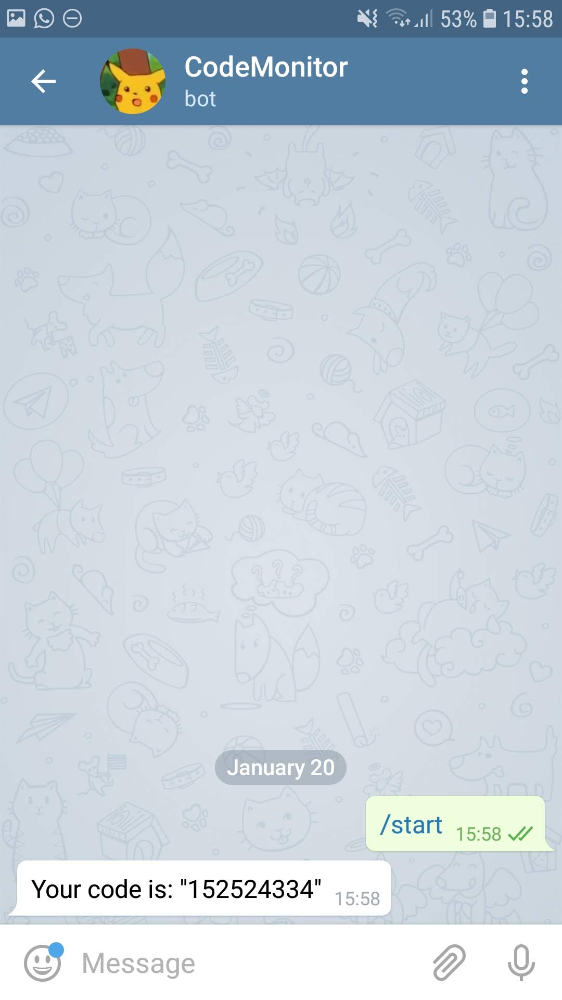

# CodeMonitor

Code Monitor is a simple way to send feedback about your code to your smartphone as a Telegram message!

# Set up

## Telegram side

1. Open Telegram and search for CodeMonitor bot.


2. Send any message to it.



3. Once you send any message the Bot will return a message like 'Your code is: "123456789"' this is your chat code, it will be used to identify your chat on python side.

## Python side

1. install the Code Monitor dependency through the following command

```
pip install CodeMonitor
```

2. now import it in your code

```
from CodeMonitor.telegram import Messenger, FitMonitor
```

3. Once CodeMonitor is imported you'll be able to use two classes: **Messenger** and **FitMonitor**, first let's talk about **Messenger**
class. 

### Messenger

This class allows you to send any string you want to the Telegram chat, only requiring the chat code as mentioned on the Telegram side section.

```
messenger = Messenger("123456789")
```

When the class is instantiated it send the message "All ready!", to send your own messages do like the following code snippet.

```
messenger.send_message("your awesome message!")
```

### FitMonitor

This class is a callback that send feedback about the training of a Keras Neural Network model, it is very usefull if you're training a model for a very long time and need to leave your computer but still want to know how good your training is doing. At the end of each epoch this callback is going to send information about the accuracy and loss (and validation accuracy and loss when possible) of the model.

```
model.fit(X_train, Y_train,          
          epochs = 10,
          validation_data = (X_test, Y_test), 
          callbacks=[FitMonitor("123456789")])
```
